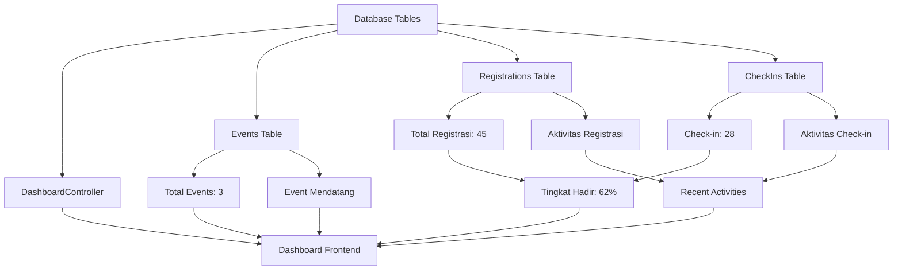

# 📊 ADMIN DASHBOARD FESTIVAL TAHURI - PANDUAN LENGKAP

> **Dokumen ini menjelaskan secara detail fitur-fitur dan alur kerja Admin Dashboard Festival Tahuri**

## 🎯 OVERVIEW DASHBOARD

Admin Dashboard Festival Tahuri adalah pusat kontrol untuk mengelola semua aktivitas event dan registrasi. Dashboard ini memberikan real-time analytics dan quick access ke semua fungsi administrasi.

---

## 📈 STATISTIK UTAMA (Analytics Cards)

### 1. 🎪 **TOTAL EVENTS**
```php
Source: Event::count()
```
- **Fungsi**: Menampilkan total event yang ada di database
- **Detail Tambahan**: Menunjukkan berapa event yang sedang aktif
- **Contoh**: "3 Events Total, 3 Aktif"
- **Warna**: Orange gradient (sesuai Festival Tahuri branding)

### 2. 👥 **TOTAL REGISTRASI** 
```php
Source: Registration::where('status', 'active')->count()
```
- **Fungsi**: Akumulasi semua pendaftaran aktif dari SEMUA event
- **Logika**: Menghitung registrasi lintas event (multi-event support)
- **Contoh**: "45 Registrasi dari semua event"
- **Warna**: Blue gradient

### 3. ✅ **CHECK-IN**
```php
Source: CheckIn::where('check_ins.status', 'checked_in')->count()
```
- **Fungsi**: Total peserta yang sudah hadir/check-in
- **Database**: Data dari tabel `check_ins` dengan status 'checked_in'
- **Contoh**: "28 orang sudah check-in"
- **Warna**: Green gradient

### 4. 📊 **TINGKAT HADIR**
```php
Formula: (Total Check-ins / Total Registrasi) × 100%
```
- **Fungsi**: Persentase kehadiran keseluruhan
- **Kalkulasi Real-time**: Dihitung otomatis dari data check-in dan registrasi
- **Contoh**: "28/45 = 62% tingkat kehadiran"
- **Warna**: Purple gradient

---

## 📅 EVENT MENDATANG

### **Logika Filter Event**
```php
Event::upcoming()                           // Tanggal >= hari ini
    ->where('date', '<=', now()->addDays(30))  // Dalam 30 hari ke depan
    ->active()                              // Status aktif
    ->orderBy('date')                       // Urutkan berdasarkan tanggal
    ->limit(5)                             // Maksimal 5 event
```

### **Informasi yang Ditampilkan**
- ✅ **Nama Event**: Judul lengkap event
- ✅ **Tanggal**: Format Indonesia (contoh: "Senin, 22 Juli 2025")
- ✅ **Progress Registrasi**: "28/500 Terdaftar"
- ✅ **Link Action**: "Lihat Semua" → `/admin/events`

### **Kasus Khusus**
- Jika tidak ada event mendatang: Tampil empty state dengan ikon Calendar
- Scroll internal jika event lebih dari 4 item (mencegah layout terlalu panjang)

---

## 🔄 AKTIVITAS TERBARU

### **Jenis Aktivitas**

#### 1. 📝 **REGISTRASI BARU** (Icon: Users, Warna: Biru)
```php
Source: Registration::with('event')
    ->where('status', 'active')
    ->orderBy('created_at', 'desc')
    ->limit(5)
```
- **Format Display**: "Nama Peserta - Mendaftar - Nama Event"
- **Timestamp**: Waktu registrasi dalam format Indonesia

#### 2. ✅ **CHECK-IN BARU** (Icon: CheckSquare, Warna: Hijau)
```php
Source: CheckIn::with(['registration.event'])
    ->where('check_ins.status', 'checked_in')
    ->orderBy('created_at', 'desc')
    ->limit(5)
```
- **Format Display**: "Nama Peserta - Check-in - Nama Event"
- **Timestamp**: Waktu check-in dalam format Indonesia

### **Algoritma Merge Activity**
```php
$recentActivities = $recentRegistrations
    ->concat($recentCheckIns)        // Gabung 2 collection
    ->sortByDesc('created_at')       // Urutkan terbaru dulu
    ->take(10)                       // Ambil 10 teratas
    ->values();                      // Reset index
```

### **Contoh Output**
```
🟢 Budi Santoso - Check-in - Seminar Financial Planner (2 menit lalu)
🔵 Sari Dewi - Mendaftar - Seminar Ekonomi Kreatif (5 menit lalu)
🟢 Ahmad Rahman - Check-in - Seminar Rupiah Talks (8 menit lalu)
```

---

## ⚡ QUICK ACTIONS (Aksi Cepat)

### **Fitur Aktif**
1. **🎪 Buat Event Baru**
   - Link: `/admin/events/create`
   - Icon: Plus
   - Function: Redirect ke form pembuatan event

2. **👥 Kelola Registrasi**
   - Link: `/admin/registrations`
   - Icon: Users
   - Function: Manajemen semua registrasi

3. **✅ Check-in System**
   - Link: `/admin/checkin`
   - Icon: CheckSquare
   - Function: Interface untuk check-in peserta

### **Fitur Tertunda (Dikomentar untuk implementasi masa depan)**
```javascript
// Advanced features yang sudah disiapkan struktur-nya:
- 📊 Export Data (PDF/Excel/CSV)
- 📈 Advanced Analytics Dashboard  
- 📱 QR Code Scanner untuk check-in
- 📧 Email/SMS Notification System
```

---

## 🔄 ALUR DATA FLOW



---

## 🎨 DESIGN SYSTEM

### **Festival Tahuri Branding**
- **Primary Colors**: Orange-Red gradient scheme
- **Cards**: Glass morphism dengan border orange
- **Buttons**: Gradient orange-to-red dengan hover effects
- **Icons**: Lucide React dengan konsistensi warna
- **Typography**: Gradient text untuk headers

### **Responsive Design**
- **Mobile First**: Layout adaptif untuk semua device
- **Container Height**: Internal scroll untuk mencegah layout terlalu panjang
- **Grid System**: Auto-responsive dengan breakpoints md/lg
- **Touch Friendly**: Button sizing optimal untuk mobile

---

## 🚀 PERFORMANCE FEATURES

### **Optimisasi Database**
- **Eager Loading**: `with()` untuk menghindari N+1 queries
- **Scoped Queries**: `active()`, `upcoming()` untuk filter efisien
- **Indexed Queries**: Status dan date fields ter-index

### **Frontend Optimisasi**
- **Conditional Rendering**: Empty states untuk UX yang baik
- **Lazy Loading**: Internal scroll untuk performance
- **Real-time Updates**: Data fresh setiap page load

---

## 📱 MOBILE RESPONSIVENESS

### **Breakpoint Strategy**
```css
sm (640px+):  Grid cols-1 → cols-2
md (768px+):  Statistics grid → cols-4
lg (1024px+): Main content → cols-2
```

### **Mobile Optimizations**
- ✅ Touch-friendly button sizes (min 44px)
- ✅ Readable font sizes (min 16px untuk inputs)
- ✅ Proper spacing untuk thumb navigation
- ✅ Horizontal scroll handling
- ✅ Collapsed navigation untuk space efficiency

---

## 🔒 SECURITY & ACCESS CONTROL

### **Role-Based Access**
```php
// Middleware: EnsureUserIsAdmin
// Route Protection: /admin/* routes
// Database: users.role = 'admin'
```

### **Data Validation**
- **SQL Injection**: Protected dengan Eloquent ORM
- **CSRF Protection**: Laravel CSRF middleware
- **Input Sanitization**: Request validation di controllers

---

## 📊 BUSINESS METRICS

### **Key Performance Indicators (KPIs)**
1. **Event Success Rate**: Berapa % event yang sukses dilaksanakan
2. **Registration Conversion**: Tingkat konversi dari visitor ke registrasi
3. **Attendance Rate**: Tingkat kehadiran peserta (currently 62%)
4. **Capacity Utilization**: Pemanfaatan kapasitas event

### **Reporting Capabilities**
- **Real-time Dashboard**: Live updates setiap page refresh
- **Historical Data**: Tracking trends dari waktu ke waktu
- **Export Ready**: Structure siap untuk export PDF/Excel
- **Analytics Integration**: Siap integrasi dengan Google Analytics

---

*Dokumen ini dibuat untuk membantu admin memahami dan menggunakan dashboard Festival Tahuri secara optimal.*

**Last Updated**: 21 Juli 2025  
**Version**: 1.0 - Production Ready