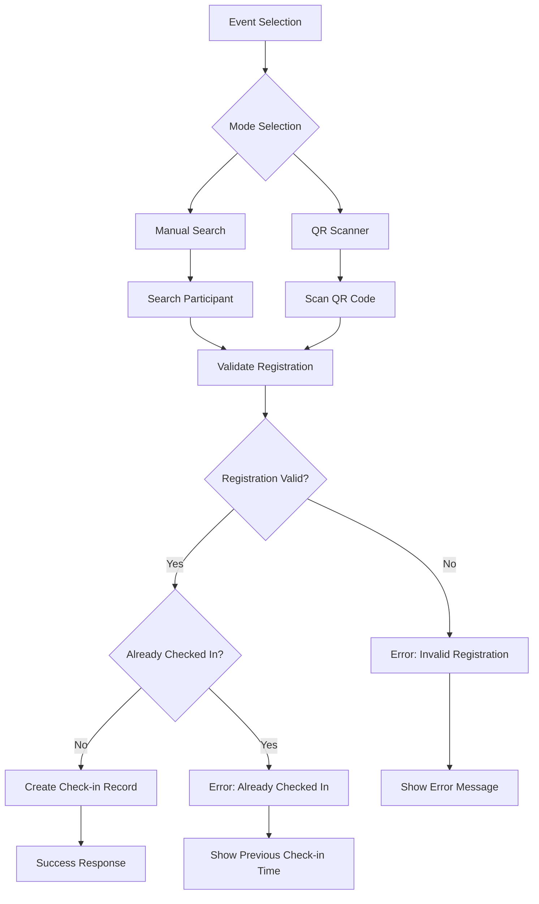
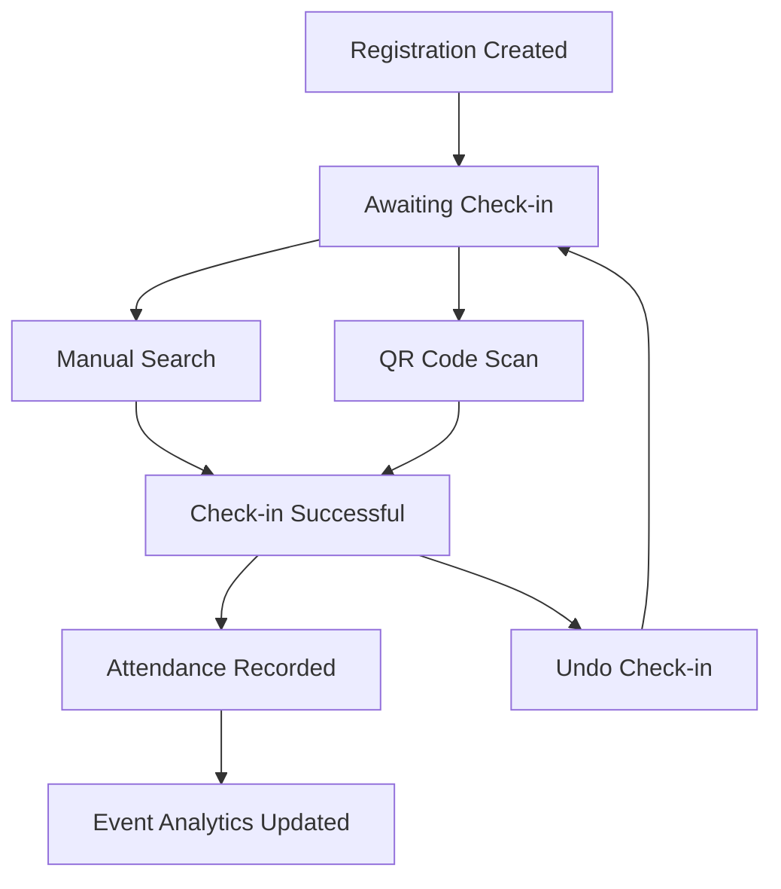

# ✅ CHECK-IN SYSTEM - FESTIVAL TAHURI

> **Dokumentasi lengkap sistem check-in peserta Festival Tahuri dengan dual mode: Manual & QR Scanner**

## 🎯 OVERVIEW CHECK-IN SYSTEM

Check-in System adalah sistem absensi digital untuk mengelola kehadiran peserta event Festival Tahuri. Sistem ini menyediakan 2 mode check-in: Manual Search dan QR Code Scanner dengan real-time validation dan reporting.

---

## 🏗️ SISTEM ARCHITECTURE

### **Check-in Flow Architecture**



---

## 📊 CHECK-IN STATISTICS DASHBOARD

### **Real-time Event Statistics (/admin/checkin)**

#### 1. **📅 Events Today**
```php
Source: Event::whereDate('date', Carbon::today())->count()
```
- **Fungsi**: Jumlah event yang berlangsung hari ini
- **Filter**: Based on event date = today
- **Contoh**: "3 Events Today"

#### 2. **👥 Registrations Today**
```php
Source: Registration::whereHas('event', function($q) {
    $q->whereDate('date', Carbon::today());
})->active()->count()
```
- **Fungsi**: Total peserta terdaftar untuk event hari ini
- **Complex Query**: Join registrations → events dengan date filter
- **Contoh**: "85 Registrations Today"

#### 3. **✅ Check-ins Today**
```php
Source: CheckIn::whereHas('registration.event', function($q) {
    $q->whereDate('date', Carbon::today());
})->checkedIn()->count()
```
- **Fungsi**: Total check-in yang sudah dilakukan hari ini
- **Deep Join**: check_ins → registrations → events
- **Contoh**: "67 Check-ins Today"

### **Event List dengan Attendance Rate**
```php
// Per-event attendance calculation
$events->map(function ($event) {
    return [
        'attendance_rate' => $event->registration_count > 0 
            ? round(($event->check_in_count / $event->registration_count) * 100, 1)
            : 0,
    ];
});
```

**Attendance Color Coding**:
- 🟢 **80%+**: Excellent attendance (green)
- 🟠 **60-79%**: Good attendance (orange)
- 🔴 **<60%**: Low attendance (red)

---

## 🔍 CHECK-IN SCANNER SYSTEM (/admin/checkin/scanner)

### **Dual Mode Check-in**

#### 1. **📱 QR Scanner Mode**
```javascript
// QR Scanner implementation (ready for activation)
/*
const [scannerMode, setScannerMode] = useState<'qr' | 'manual'>('qr');

// QR Code structure: JSON with registration data
const qrCodeData = {
    registration_id: 123,
    ticket_number: "BISF001T",
    event_id: 1,
    hash: "validation_hash"
};
*/
```

**Features (Structure Ready)**:
- **Camera Access**: Browser camera untuk scan QR
- **Real-time Validation**: Instant validation saat scan
- **Audio Feedback**: Beep sound untuk success/error
- **Torch Control**: Flashlight toggle untuk kondisi gelap

#### 2. **🔍 Manual Search Mode**
```php
// Advanced search implementation
$registrations = $query->where(function ($q) use ($searchTerm) {
    $q->where('ticket_number', 'like', "%{$searchTerm}%")
      ->orWhere('full_name', 'like', "%{$searchTerm}%")
      ->orWhere('nik', 'like', "%{$searchTerm}%")
      ->orWhere('phone', 'like', "%{$searchTerm}%")
      ->orWhere('email', 'like', "%{$searchTerm}%");
})->limit(10)->get();
```

**Search Fields**:
- ✅ **Ticket Number**: Format "BISF001T"
- ✅ **Full Name**: Nama lengkap peserta
- ✅ **NIK**: Nomor Induk Kependudukan
- ✅ **Phone**: Nomor telepon
- ✅ **Email**: Alamat email

### **Search Results Interface**
```javascript
// Search result display
interface Registration {
    id: number;
    ticket_number: string;
    full_name: string;
    nik: string;
    phone: string;
    email: string;
    event_title: string;
    event_code: string;
    event_date: string;
    event_time?: string;
    is_checked_in: boolean;
    check_in_time?: string;
    registration_date: string;
}
```

**Search Result Cards**:
- **Participant Info**: Nama, NIK, Phone, Email
- **Event Info**: Event title, date, time
- **Status Badge**: Check-in status dengan warna
- **Action Button**: "Check In" atau "Already Checked In"

---

## ✅ CHECK-IN PROCESS & VALIDATION

### **Check-in Validation Logic**
```php
public function checkIn(Request $request)
{
    $registration = Registration::with(['event', 'checkIn'])->find($request->registration_id);
    
    // 1. Validate registration status
    if ($registration->status !== 'active') {
        return response()->json([
            'success' => false,
            'message' => 'Registrasi tidak valid atau sudah dibatalkan.',
        ], 400);
    }
    
    // 2. Check if already checked in
    if ($registration->isCheckedIn()) {
        return response()->json([
            'success' => false,
            'message' => 'Peserta sudah melakukan check-in sebelumnya.',
            'check_in_time' => $registration->checkIn->check_in_time->format('Y-m-d H:i:s'),
        ], 400);
    }
    
    // 3. Create check-in record
    $checkIn = CheckIn::create([
        'registration_id' => $registration->id,
        'check_in_time' => now(),
        'admin_user_id' => auth()->id(),
        'status' => 'checked_in',
    ]);
}
```

### **Validation Rules**
1. **Registration Active**: Status harus 'active'
2. **Not Already Checked In**: Prevent double check-in
3. **Event Exists**: Registration harus terkait event valid
4. **Admin Authentication**: Hanya admin yang bisa check-in

### **Check-in Response**
```json
{
    "success": true,
    "message": "Check-in berhasil!",
    "data": {
        "registration_id": 123,
        "participant_name": "Budi Santoso",
        "ticket_number": "BISF001T",
        "event_title": "Seminar Financial Planner",
        "check_in_time": "2025-07-21 09:30:00"
    }
}
```

---

## 🔄 UNDO CHECK-IN FUNCTIONALITY

### **Undo Check-in Logic**
```php
public function undo(Request $request)
{
    $registration = Registration::with(['checkIn'])->find($request->registration_id);
    
    // Check if checked in
    if (!$registration->isCheckedIn()) {
        return response()->json([
            'success' => false,
            'message' => 'Peserta belum melakukan check-in.',
        ], 400);
    }
    
    // Delete check-in record
    $registration->checkIn->delete();
    
    return response()->json([
        'success' => true,
        'message' => 'Check-in berhasil dibatalkan.',
    ]);
}
```

### **Use Cases untuk Undo**
- **Human Error**: Admin salah scan/pilih peserta
- **Technical Issues**: Double scan karena network lag
- **Correction**: Koreksi data check-in yang salah
- **Testing**: Reset check-in untuk testing purpose

---

## 📊 EVENT CHECK-IN REPORT (/admin/checkin/report/{event})

### **Comprehensive Event Report**

#### **📈 Event Statistics**
```php
$statistics = [
    'total_registrations' => $registrations->count(),
    'checked_in' => $registrations->where('is_checked_in', true)->count(),
    'not_checked_in' => $registrations->where('is_checked_in', false)->count(),
    'attendance_rate' => $registrations->count() > 0 
        ? round(($registrations->where('is_checked_in', true)->count() / $registrations->count()) * 100, 1)
        : 0,
];
```

#### **👥 Participant List**
```php
// Complete participant data for report
$registrations = $event->registrations()
    ->with(['checkIn'])
    ->active()
    ->orderBy('created_at', 'desc')
    ->get()
    ->map(function ($registration) {
        return [
            'ticket_number' => $registration->ticket_number,
            'full_name' => $registration->full_name,
            'nik' => $registration->nik,
            'phone' => $registration->phone,
            'email' => $registration->email,
            'is_checked_in' => $registration->isCheckedIn(),
            'check_in_time' => $registration->checkIn?->check_in_time?->format('Y-m-d H:i:s'),
            'registration_date' => $registration->registration_date->format('Y-m-d H:i:s'),
        ];
    });
```

### **Report Features**
- **Real-time Data**: Data update otomatis setiap refresh
- **Export Ready**: Structure siap untuk PDF/Excel export
- **Filter Options**: Filter by check-in status
- **Sort Options**: Sort by name, check-in time, registration date

---

## 🎯 BUSINESS LOGIC & WORKFLOWS

### **Check-in Business Rules**

#### **Time-based Rules**
- **Early Check-in**: Boleh check-in H-1 event
- **Late Check-in**: Masih bisa check-in setelah event dimulai
- **Cut-off Time**: (Optional) Batas waktu maksimal check-in

#### **Event-based Rules**
- **Multi-event**: Peserta bisa check-in untuk berbagai event
- **Single Check-in**: Satu registrasi = satu check-in per event
- **Cross-event**: Check-in di event A tidak mempengaruhi event B

#### **Admin Control**
- **Admin Tracking**: Setiap check-in tercatat admin yang melakukan
- **Audit Trail**: Log lengkap untuk compliance
- **Override Capability**: Admin bisa undo check-in jika diperlukan

### **Check-in States**



---

## 📱 MOBILE & DEVICE OPTIMIZATION

### **Mobile-First Design**
- **Touch-friendly**: Button sizes optimal untuk finger tap
- **Camera Integration**: Native camera API untuk QR scanner
- **Offline Capability**: (Future) Cache untuk network issues
- **Battery Optimization**: Efficient scanning untuk long-duration events

### **Device Compatibility**
- **Tablets**: Optimized untuk iPad/Android tablet usage
- **Smartphones**: Responsive design untuk berbagai screen sizes
- **Desktop**: Full-featured interface untuk admin station
- **Barcode Scanners**: (Future) Integration dengan hardware scanners

---

## 🚀 PERFORMANCE OPTIMIZATIONS

### **Real-time Performance**
```php
// Efficient queries dengan proper indexing
$query = Registration::with(['event', 'checkIn'])
    ->where('event_id', $eventId)
    ->active();

// Database indexes untuk performance
// - registrations(event_id, status)
// - check_ins(registration_id, status)
// - check_ins(created_at)
```

### **Search Optimization**
- **Debounced Search**: 300ms delay untuk menghindari excessive queries
- **Result Limitation**: Maximum 10 results untuk fast response
- **Cache Strategy**: Cache frequent searches untuk better UX
- **Progressive Loading**: Load additional results on scroll

---

## 🔒 SECURITY & FRAUD PREVENTION

### **Anti-fraud Measures**
- **Unique Check-in**: Prevent duplicate check-in dengan database constraint
- **Time Validation**: Check-in hanya bisa dilakukan dalam window tertentu
- **Admin Authentication**: Hanya admin authenticated yang bisa check-in
- **IP Logging**: Track IP address untuk audit trail

### **QR Code Security** (Future Implementation)
```javascript
// QR Code validation with hash
const qrValidation = {
    registration_id: 123,
    ticket_number: "BISF001T",
    timestamp: "2025-07-21T09:00:00Z",
    hash: sha256(registration_id + ticket_number + secret_key + timestamp)
};
```

### **Data Protection**
- **Sensitive Data**: Mask NIK/phone di display
- **HTTPS Only**: Semua communication encrypted
- **Session Management**: Auto-logout untuk security
- **Rate Limiting**: Prevent brute force attempts

---

## 📊 ANALYTICS & REPORTING

### **Real-time Analytics**
- **Live Dashboard**: Real-time update check-in statistics
- **Event Progress**: Progress bar untuk setiap event
- **Attendance Trends**: Graph kehadiran per jam
- **Admin Activity**: Log activity per admin

### **Advanced Reports** (Future Implementation)
- **Attendance Patterns**: Analisis pola kehadiran
- **Time Analysis**: Peak check-in times
- **Event Comparison**: Compare attendance across events
- **Demographic Analysis**: Attendee demographics breakdown

---

## 🎨 UI/UX DESIGN PATTERNS

### **Check-in Interface Design**
- **Color System**: 
  - 🟢 Green untuk success/checked-in
  - 🔴 Red untuk error/not-checked-in
  - 🟠 Orange untuk warning/pending
  - 🔵 Blue untuk info/neutral states

### **Feedback Mechanisms**
- **Visual Feedback**: Color changes, animations
- **Audio Feedback**: Sound effects untuk scan results
- **Haptic Feedback**: Vibration untuk mobile devices
- **Toast Notifications**: Non-intrusive messages

### **Accessibility Features**
- **Screen Reader**: Compatible dengan screen readers
- **High Contrast**: Mode untuk low vision users
- **Large Buttons**: Touch-friendly untuk seniors
- **Voice Commands**: (Future) Voice-activated check-in

---

## 🔮 FUTURE ENHANCEMENTS

### **QR Code Scanner Implementation**
```javascript
// Ready-to-activate QR scanner features
/*
- Camera access dan permission handling
- Real-time QR code detection
- Batch scanning untuk multiple attendees
- Audio/visual feedback untuk scan results
- Integration dengan native mobile apps
*/
```

### **Advanced Features (Commented in Code)**
- **Bulk Check-in**: Mass check-in untuk grup registrations
- **Photo Capture**: Foto peserta saat check-in
- **Digital Signatures**: Electronic signature untuk attendance
- **Integration APIs**: Webhook untuk external systems
- **Real-time Notifications**: Push notifications untuk stakeholders

---

*Dokumentasi ini memberikan panduan lengkap untuk sistem check-in peserta Festival Tahuri dengan fokus pada efficiency, security, dan user experience.*

**Last Updated**: 21 Juli 2025  
**Version**: 1.0 - Production Ready dengan QR Scanner Ready for Activation