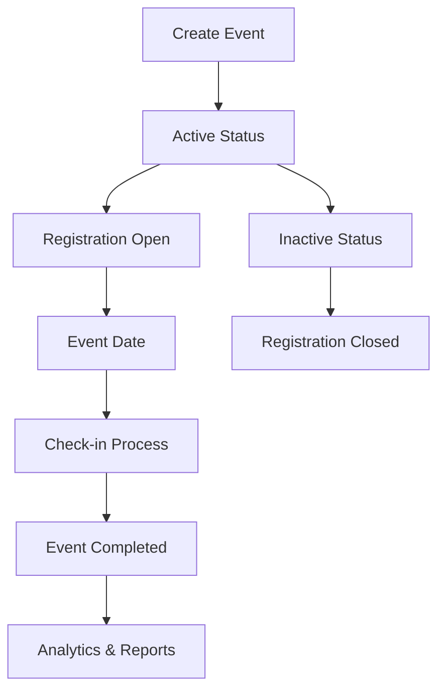

# 🎪 EVENT MANAGEMENT SYSTEM - FESTIVAL TAHURI

> **Dokumentasi lengkap sistem manajemen event untuk admin Festival Tahuri**

## 🎯 OVERVIEW EVENT MANAGEMENT

Event Management System adalah modul utama untuk mengelola semua event Festival Tahuri. Sistem ini menyediakan CRUD lengkap (Create, Read, Update, Delete) dengan fitur pencarian, filtering, dan analytics real-time.

---

## 📋 MENU STRUKTUR EVENT MANAGEMENT

### **🏠 Dashboard → Event Management (/admin/events)**

```
Event Management
├── 📊 Statistics Overview
├── 🔍 Search & Filter System  
├── 📋 Events List Table
├── 👁️ Event Detail View
├── ✏️ Create/Edit Forms
└── 🗑️ Delete Management
```

---

## 📊 STATISTICS OVERVIEW

### **Event Statistics Cards**
```php
Source: EventController@index
```

#### 1. **📈 Total Events**
- **Data**: `Event::count()`
- **Fungsi**: Jumlah total semua event di database
- **Contoh**: "3 Total Events"

#### 2. **✅ Active Events** 
- **Data**: `Event::active()->count()`
- **Fungsi**: Event dengan status 'active'
- **Contoh**: "3 Active Events"

#### 3. **🔮 Upcoming Events**
- **Data**: `Event::upcoming()->count()`
- **Fungsi**: Event dengan tanggal >= hari ini
- **Contoh**: "2 Upcoming Events"

#### 4. **📚 Past Events**
- **Data**: `Event::past()->count()` 
- **Fungsi**: Event yang sudah berlalu
- **Contoh**: "1 Past Event"

---

## 🔍 SEARCH & FILTER SYSTEM

### **Search Functionality**
```php
// Multi-field search
$query->where(function ($q) use ($request) {
    $q->where('title', 'like', '%' . $request->search . '%')
      ->orWhere('event_code', 'like', '%' . $request->search . '%')  
      ->orWhere('location', 'like', '%' . $request->search . '%');
});
```

**Pencarian berdasarkan**:
- ✅ **Nama Event** (title)
- ✅ **Kode Event** (event_code) 
- ✅ **Lokasi** (location)

### **Filter Options**

#### 1. **📊 Status Filter**
```php
// Filter berdasarkan status
if ($request->filled('status')) {
    $query->where('status', $request->status);
}
```
- **Active**: Event yang sedang aktif
- **Inactive**: Event yang dinonaktifkan

#### 2. **📅 Date Range Filter**
```php
// Filter berdasarkan tanggal
if ($request->filled('date_from')) {
    $query->where('date', '>=', $request->date_from);
}
if ($request->filled('date_to')) {
    $query->where('date', '<=', $request->date_to);
}
```
- **Date From**: Tanggal mulai
- **Date To**: Tanggal akhir

### **Advanced Search Features**
- **Real-time Search**: Pencarian langsung saat mengetik
- **Preserve State**: Filter tetap tersimpan saat navigasi
- **Clear Filters**: Reset semua filter dengan 1 klik
- **Query String**: URL tetap shareable dengan filter

---

## 📋 EVENTS LIST TABLE

### **Table Columns**

#### **📊 Event Information**
1. **Event Code**: Kode unik auto-generated (contoh: "SF", "SRT", "SEK")
2. **Title**: Nama lengkap event
3. **Date & Time**: Tanggal dan waktu pelaksanaan
4. **Location**: Lokasi event
5. **Speakers**: Narasumber/pembicara

#### **📈 Registration Metrics**
6. **Registration Count**: Jumlah peserta terdaftar
7. **Max Capacity**: Kapasitas maksimal
8. **Available Slots**: Slot tersisa
9. **Status**: Active/Inactive dengan badge warna

#### **⚡ Actions**
10. **View**: Lihat detail event
11. **Edit**: Edit informasi event  
12. **Delete**: Hapus event (jika belum ada registrasi)

### **Data Transformation**
```php
// Data yang dikirim ke frontend
return [
    'id' => $event->id,
    'title' => $event->title,
    'event_code' => $event->event_code,
    'date' => $event->date->format('Y-m-d'),
    'time' => $event->time?->format('H:i'),
    'location' => $event->location,
    'status' => $event->status,
    'max_capacity' => $event->max_capacity,
    'registration_count' => $event->registration_count,
    'available_slots' => $event->getAvailableSlots(),
    'speakers' => $event->speakers,
];
```

### **Pagination System**
- **Per Page**: 10 events per halaman
- **Laravel Pagination**: Built-in pagination dengan query string preservation
- **Responsive**: Pagination controls adaptif untuk mobile

---

## 👁️ EVENT DETAIL VIEW (/admin/events/{id})

### **Detail Information Sections**

#### 1. **📊 Event Overview**
```php
// Data lengkap event
$eventData = [
    'id', 'title', 'event_code', 'description', 'speakers',
    'date', 'time', 'location', 'max_capacity', 'poster_url',
    'status', 'registration_count', 'check_in_count',
    'available_slots', 'created_at', 'updated_at'
];
```

#### 2. **📈 Registration Analytics**
- **Total Registrations**: Jumlah pendaftar
- **Check-in Count**: Yang sudah hadir
- **Available Slots**: Slot tersisa
- **Attendance Rate**: Tingkat kehadiran untuk event ini

#### 3. **👥 Recent Registrations (10 Terbaru)**
```php
$recentRegistrations = $event->registrations()
    ->active()
    ->orderBy('created_at', 'desc')
    ->limit(10)
    ->get()
```

**Menampilkan**:
- Nama lengkap peserta
- Email dan nomor telepon
- Nomor tiket
- Status registrasi
- Status check-in
- Waktu pendaftaran

#### 4. **⚡ Quick Actions**
- **Edit Event**: Redirect ke halaman edit
- **Manage Registrations**: Lihat semua registrasi event ini
- **Check-in System**: Langsung ke sistem check-in untuk event ini

---

## ✏️ CREATE EVENT FORM (/admin/events/create)

### **Form Fields & Validation**

#### **📝 Basic Information**
```php
'title' => 'required|string|max:255',
'description' => 'required|string',
'speakers' => 'required|string',
```

#### **📅 Date & Time**
```php
'date' => 'required|date|after:today',      // Harus tanggal masa depan
'time' => 'required|date_format:H:i',       // Format 24 jam
```

#### **📍 Location & Capacity**
```php
'location' => 'required|string|max:255',
'max_capacity' => 'required|integer|min:1|max:1000',  // 1-1000 peserta
```

#### **🎨 Optional Fields**
```php
'poster_url' => 'nullable|url',             // URL gambar poster
'status' => 'required|in:active,inactive',  // Status default
```

### **Auto-Generated Fields**

#### **🏷️ Event Code Generation**
```php
private function generateEventCode(string $title): string
{
    // "Seminar Financial Planner" → "SFP"
    // "Workshop Design" → "WD" 
    // "Rupiah Talks" → "RT"
}
```

**Algoritma**:
1. Ambil huruf pertama setiap kata
2. Maksimal 4 karakter, minimal 2 karakter
3. Check uniqueness, tambah angka jika duplikat
4. Contoh: "SF" → "SF1" → "SF2" (jika sudah ada)

---

## ✏️ EDIT EVENT FORM (/admin/events/{id}/edit)

### **Edit Validations & Restrictions**

#### **📊 Capacity Validation**
```php
// Kapasitas tidak boleh kurang dari jumlah yang sudah terdaftar
if ($validated['max_capacity'] < $event->registration_count) {
    return back()->withErrors([
        'max_capacity' => 'Kapasitas tidak boleh kurang dari jumlah peserta terdaftar (' . $event->registration_count . ')'
    ]);
}
```

#### **📅 Date Validation** 
- **Create**: Tanggal harus masa depan (`after:today`)
- **Edit**: Tanggal bisa masa lalu (untuk event yang sudah berlalu)

#### **🔒 Protected Fields**
- **Event Code**: Tidak bisa diedit (auto-generated, tetap konsisten)
- **Created At**: Read-only timestamp

### **Update Success Flow**
```php
$event->update($validated);
return redirect()->route('admin.events.show', $event)
    ->with('success', 'Event berhasil diperbarui!');
```

---

## 🗑️ DELETE MANAGEMENT

### **Delete Protection Logic**
```php
public function destroy(Event $event)
{
    // Cek apakah event memiliki registrasi
    if ($event->registrations()->exists()) {
        return back()->withErrors([
            'delete' => 'Event tidak dapat dihapus karena sudah memiliki peserta terdaftar.'
        ]);
    }
    
    $event->delete();
    return redirect()->route('admin.events.index')
        ->with('success', 'Event berhasil dihapus!');
}
```

### **Delete Rules**
- ✅ **Bisa Dihapus**: Event tanpa registrasi
- ❌ **Tidak Bisa Dihapus**: Event yang sudah memiliki peserta
- 🔄 **Alternative**: Set status menjadi 'inactive' instead of delete

### **Cascade Implications**
Jika event dihapus, maka:
- **Registrations**: Akan ter-cascade delete (foreign key constraint)
- **Check-ins**: Akan ter-cascade delete melalui registrations
- **Files**: Poster URL menjadi broken link (manual cleanup needed)

---

## 🔄 BUSINESS LOGIC & WORKFLOWS

### **Event Lifecycle**



### **Status Management**
- **Active**: Event terbuka untuk registrasi
- **Inactive**: Event ditutup, tidak bisa registrasi baru

### **Capacity Management**
- **Real-time Slots**: `getAvailableSlots()` method
- **Overbooking Prevention**: Validasi saat registrasi
- **Capacity Updates**: Harus >= current registrations

---

## 📱 MOBILE RESPONSIVENESS

### **Table Responsiveness**
- **Desktop**: Full table dengan semua kolom
- **Tablet**: Collapsed actions ke dropdown
- **Mobile**: Card layout instead of table

### **Form Optimization**
- **Touch-friendly**: Input fields minimal 44px height
- **Keyboard Types**: Email, number, date inputs
- **Validation Feedback**: Real-time error display

---

## 🚀 PERFORMANCE OPTIMIZATIONS

### **Database Optimizations**
```php
// Eager loading untuk menghindari N+1 queries
$query = Event::query()->with(['registrations']);

// Pagination dengan query string preservation
$events = $query->orderBy('date', 'desc')
    ->paginate(10)
    ->withQueryString();
```

### **Frontend Optimizations**
- **Preserve State**: Filter dan search state preserved
- **Lazy Loading**: Large datasets dengan pagination
- **Debounced Search**: Menghindari excessive API calls

---

## 🔒 SECURITY & PERMISSIONS

### **Access Control**
- **Admin Only**: Semua routes dilindungi middleware `EnsureUserIsAdmin`
- **CSRF Protection**: Semua forms protected
- **Input Validation**: Server-side validation untuk semua input

### **Data Sanitization**
- **XSS Prevention**: Otomatis handled oleh Laravel
- **SQL Injection**: Protected oleh Eloquent ORM
- **File Upload**: URL validation untuk poster

---

## 📊 ANALYTICS & REPORTING

### **Available Metrics**
1. **Event Performance**: Registration vs capacity ratio
2. **Popular Events**: Berdasarkan registration count
3. **Time Trends**: Event creation dan registration patterns
4. **Location Analysis**: Event terpopuler berdasarkan lokasi

### **Export Capabilities (Future)**
- **PDF Reports**: Event summary dengan statistik
- **Excel Export**: Data lengkap untuk analysis
- **CSV Export**: Data peserta untuk external tools

---

## 🔧 TECHNICAL SPECIFICATIONS

### **API Endpoints**
```php
Route::prefix('admin')->middleware(['auth', 'admin'])->group(function () {
    Route::resource('events', EventController::class);
});
```

### **Database Relations**
```php
// Event Model Relations
public function registrations(): HasMany
public function checkIns(): HasManyThrough
```

### **Frontend Components**
- **React 19**: Modern React dengan hooks
- **Inertia.js**: SPA experience tanpa API complexity
- **Tailwind CSS**: Utility-first styling
- **Lucide Icons**: Consistent icon system

---

*Dokumentasi ini memberikan panduan lengkap untuk mengelola event dalam sistem Festival Tahuri.*

**Last Updated**: 21 Juli 2025  
**Version**: 1.0 - Production Ready