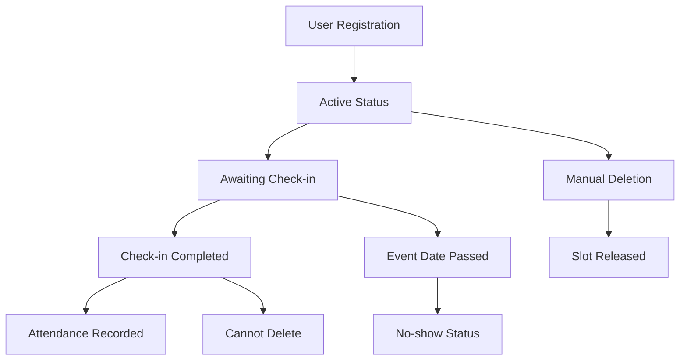

# 👥 REGISTRATION MANAGEMENT SYSTEM - FESTIVAL TAHURI

> **Dokumentasi lengkap sistem manajemen registrasi peserta Festival Tahuri**

## 🎯 OVERVIEW REGISTRATION MANAGEMENT

Registration Management System adalah pusat kontrol untuk mengelola semua pendaftaran peserta event Festival Tahuri. Sistem ini menyediakan monitoring real-time, pencarian advanced, dan bulk operations untuk efisiensi maksimal.

---

## 📊 STATISTIK REGISTRASI

### **Real-time Analytics Cards**

#### 1. **📈 Total Registrations**
```php
Source: Registration::count()
```
- **Fungsi**: Total semua registrasi di database
- **Scope**: Lintas semua event (multi-event support)
- **Contoh**: "145 Total Registrations"

#### 2. **✅ Total Checked In**
```php
Source: Registration::whereHas('checkIn')->count()
```
- **Fungsi**: Jumlah peserta yang sudah check-in
- **Relasi**: Join dengan tabel `check_ins`
- **Contoh**: "98 Already Checked In"

#### 3. **📅 Registrations Today**
```php
Source: Registration::whereDate('created_at', today())->count()
```
- **Fungsi**: Pendaftaran baru hari ini
- **Time Filter**: Based on `created_at` date
- **Contoh**: "12 Registrations Today"

#### 4. **🎯 Check-ins Today**
```php
Source: Registration::whereHas('checkIn', function ($q) {
    $q->whereDate('created_at', today());
})->count()
```
- **Fungsi**: Check-in yang terjadi hari ini
- **Complex Query**: Join registrations → check_ins dengan date filter
- **Contoh**: "8 Check-ins Today"

---

## 🔍 ADVANCED SEARCH & FILTER SYSTEM

### **Multi-Field Search**
```php
// Search implementation
$query->where(function ($q) use ($search) {
    $q->where('full_name', 'like', "%{$search}%")
      ->orWhere('email', 'like', "%{$search}%")
      ->orWhere('nik', 'like', "%{$search}%")
      ->orWhere('ticket_number', 'like', "%{$search}%");
});
```

**Pencarian berdasarkan**:
- ✅ **Nama Lengkap** (full_name)
- ✅ **Email** (email)
- ✅ **NIK** (nik) 
- ✅ **Nomor Tiket** (ticket_number)

### **Filter Options**

#### 1. **🎪 Event Filter**
```php
// Filter by specific event
if ($request->filled('event_id')) {
    $query->where('event_id', $request->event_id);
}
```
- **Dropdown**: List semua events dari database
- **Function**: Filter registrasi berdasarkan event tertentu
- **Use Case**: Melihat registrasi "Seminar Financial Planner" saja

#### 2. **📊 Status Filter**
```php
// Check-in status filter
if ($request->status === 'checked_in') {
    $query->whereHas('checkIn');
} elseif ($request->status === 'not_checked_in') {
    $query->whereDoesntHave('checkIn');
}
```

**Status Options**:
- **All**: Semua registrasi
- **Checked In**: Yang sudah check-in
- **Not Checked In**: Belum check-in

### **Smart Filtering Logic**
- **Real-time**: Filter langsung saat berubah
- **Preserve State**: Filter bertahan saat paginasi
- **URL Shareable**: Filter tersimpan di URL
- **Performance**: Efficient queries dengan proper indexing

---

## 📋 REGISTRATION LIST TABLE

### **Table Columns & Data**

#### **👤 Participant Information**
1. **Full Name**: Nama lengkap peserta
2. **Email**: Email address dengan ikon Mail
3. **Phone**: Nomor telepon dengan ikon Phone
4. **NIK**: Nomor Induk Kependudukan (16 digit)
5. **Ticket Number**: Format `BI{EVENT_CODE}{NUMBER}T`

#### **🎪 Event Information**
6. **Event Title**: Nama event yang diikuti
7. **Event Code**: Kode singkat event (SF, SRT, SEK)
8. **Event Date**: Tanggal pelaksanaan event
9. **Location**: Lokasi event dengan ikon MapPin

#### **📊 Status Information**
10. **Registration Date**: Waktu pendaftaran dengan ikon Calendar
11. **Check-in Status**: Badge dengan warna berbeda
    - 🟢 **Checked In**: Green badge dengan waktu check-in
    - 🔴 **Not Checked In**: Red badge "Belum Check-in"

#### **⚡ Actions**
12. **View Details**: Eye icon → Detail registrasi
13. **Delete**: Trash icon → Hapus registrasi (jika belum check-in)

### **Data Structure**
```php
// Registration data transformation
return [
    'id' => $registration->id,
    'full_name' => $registration->full_name,
    'email' => $registration->email,
    'phone' => $registration->phone,
    'nik' => $registration->nik,
    'ticket_number' => $registration->ticket_number,
    'created_at' => $registration->created_at->format('Y-m-d H:i:s'),
    'event' => [
        'id' => $event->id,
        'title' => $event->title,
        'event_code' => $event->event_code,
        'date' => $event->date->format('Y-m-d'),
        'location' => $event->location,
    ],
    'check_in' => $registration->checkIn ? [
        'id' => $checkIn->id,
        'created_at' => $checkIn->created_at->format('Y-m-d H:i:s'),
    ] : null,
];
```

---

## 👁️ REGISTRATION DETAIL VIEW

### **Detail Page Features (/admin/registrations/{id})**

#### **📊 Complete Participant Profile**
- **Personal Information**: Nama, NIK, Email, Phone
- **Event Details**: Event yang diikuti, tanggal, lokasi
- **Registration Metadata**: Tanggal daftar, nomor tiket
- **Check-in Status**: Status kehadiran dengan timestamp

#### **🎫 Ticket Information**
- **Ticket Number**: Format unik dengan event code
- **QR Code**: (Ready for future implementation)
- **PDF Download**: Link ke tiket PDF
- **Verification Status**: Valid/Invalid badge

#### **📈 Related Information**
- **Event Capacity**: Position dalam antrian registrasi
- **Check-in History**: Log check-in jika ada
- **Admin Notes**: (Structure ready for future)

---

## 🗑️ DELETE MANAGEMENT & PROTECTION

### **Delete Protection Logic**
```php
public function destroy(Registration $registration)
{
    // Only allow deletion if not checked in
    if ($registration->checkIn) {
        return back()->withErrors([
            'message' => 'Cannot delete registration that has already been checked in.'
        ]);
    }
    
    $registration->delete();
    return back()->with('success', 'Registration deleted successfully.');
}
```

### **Delete Rules**
- ✅ **Bisa Dihapus**: Registrasi yang belum check-in
- ❌ **Tidak Bisa Dihapus**: Registrasi yang sudah check-in
- 🔄 **Business Logic**: Mencegah kehilangan data attendance

### **Cascade Effects**
Jika registrasi dihapus:
- **Check-in Records**: Otomatis terhapus (foreign key cascade)
- **Event Capacity**: Slot tersedia bertambah
- **Analytics**: Statistik terupdate real-time

---

## 📦 BULK OPERATIONS

### **Bulk Action Implementation**
```php
public function bulkAction(Request $request)
{
    $validated = $request->validate([
        'action' => 'required|in:delete,export',
        'registration_ids' => 'required|array',
        'registration_ids.*' => 'exists:registrations,id',
    ]);
}
```

### **Available Bulk Actions**

#### 1. **🗑️ Bulk Delete**
```php
// Only delete registrations that haven't been checked in
$deletableRegistrations = Registration::whereIn('id', $request->registration_ids)
    ->whereDoesntHave('checkIn')
    ->get();

$deletableRegistrations->each->delete();
```

**Features**:
- **Smart Protection**: Skip yang sudah check-in
- **Feedback**: Report berapa yang dihapus vs di-skip
- **Confirmation**: Dialog konfirmasi sebelum action

#### 2. **📊 Bulk Export** (Future Implementation)
```php
// Structure ready for implementation
/*
if ($request->action === 'export') {
    $registrations = Registration::with(['event', 'checkIn'])
        ->whereIn('id', $request->registration_ids)
        ->get();
    
    // TODO: Implement CSV/Excel export
    // return Excel::download(new RegistrationsExport($registrations), 'registrations.xlsx');
}
*/
```

**Planned Features**:
- **CSV Export**: Data tabular untuk spreadsheet
- **Excel Export**: Formatted report dengan charts
- **PDF Export**: Professional report untuk printing
- **Custom Fields**: Select kolom yang ingin di-export

---

## 📊 BUSINESS LOGIC & WORKFLOWS

### **Registration Lifecycle**



### **Status Management**
- **Active**: Default status untuk registrasi baru
- **Checked In**: Otomatis setelah scan/manual check-in
- **No Show**: (Future) Otomatis setelah event berakhir tanpa check-in

### **Data Integrity Rules**
1. **NIK Uniqueness**: Per event (satu NIK per event)
2. **Email Uniqueness**: Per event (satu email per event)
3. **Phone Uniqueness**: Per event (satu phone per event)
4. **Ticket Number**: Global unique across all events
5. **Capacity Respect**: Tidak boleh melebihi max_capacity

---

## 🔄 INTEGRATION DENGAN SISTEM LAIN

### **Event Management Integration**
```php
// Update event metrics when registration changes
$event->registration_count = $event->registrations()->active()->count();
$event->available_slots = $event->max_capacity - $event->registration_count;
```

### **Check-in System Integration**
```php
// Registration status affects check-in ability
public function isCheckedIn(): bool
{
    return $this->checkIn()->exists();
}
```

### **Dashboard Analytics Integration**
- **Real-time Updates**: Registration changes update dashboard statistics
- **Activity Feed**: New registrations appear in recent activities
- **Event Overview**: Registration count updates in event cards

---

## 📱 MOBILE RESPONSIVENESS

### **Table Responsiveness Strategy**
- **Desktop**: Full table dengan semua kolom
- **Tablet**: Hidden non-essential columns
- **Mobile**: Card layout dengan swipe actions

### **Search & Filter Mobile UX**
- **Sticky Search**: Search bar tetap di atas saat scroll
- **Filter Drawer**: Collapse filter ke side drawer di mobile
- **Touch Actions**: Swipe to delete, tap to view

---

## 🚀 PERFORMANCE OPTIMIZATIONS

### **Database Optimizations**
```php
// Efficient queries dengan eager loading
$registrations = Registration::with(['event', 'checkIn'])
    ->latest()
    ->paginate(20);

// Index optimizations
// - registrations(event_id, status)
// - registrations(created_at)
// - registrations(nik, email, phone)
```

### **Frontend Optimizations**
- **Virtual Scrolling**: Untuk dataset besar
- **Debounced Search**: Menghindari excessive API calls
- **Lazy Loading**: Component loading on demand
- **State Management**: Efficient filter state handling

---

## 🔒 SECURITY & PRIVACY

### **Data Protection**
- **NIK Masking**: Partial display (****-****-1234)
- **Email Privacy**: Option untuk mask email
- **Phone Security**: Partial display untuk non-admin
- **GDPR Compliance**: Delete functionality untuk right to be forgotten

### **Access Control**
```php
// Admin-only access
Route::middleware(['auth', 'admin'])->group(function () {
    Route::resource('registrations', RegistrationController::class)
        ->only(['index', 'show', 'destroy']);
});
```

### **Audit Trail** (Future Implementation)
- **Who**: Admin yang melakukan perubahan
- **What**: Action yang dilakukan (view, delete, export)
- **When**: Timestamp dengan timezone
- **Why**: Optional reason/note

---

## 📊 REPORTING & ANALYTICS

### **Available Reports**
1. **Registration Trends**: Registrasi per hari/minggu/bulan
2. **Event Popularity**: Ranking event berdasarkan registrasi
3. **Demographics**: Analisis peserta berdasarkan lokasi/age
4. **Attendance Patterns**: Korelasi registrasi vs kehadiran

### **Export Capabilities**
- **Real-time Export**: Download data saat itu juga
- **Scheduled Reports**: (Future) Email report otomatis
- **Custom Filters**: Export dengan filter yang aktif
- **Format Options**: CSV, Excel, PDF

---

## 🎨 UI/UX DESIGN PATTERNS

### **Festival Tahuri Design System**
- **Color Coding**: 
  - 🟢 Green untuk Checked In
  - 🔴 Red untuk Not Checked In  
  - 🟠 Orange untuk pending actions
- **Icons**: Consistent Lucide React icon set
- **Typography**: Gradient text untuk headers
- **Spacing**: Consistent padding dan margins

### **Interaction Patterns**
- **Hover Effects**: Subtle animations pada table rows
- **Loading States**: Skeleton loading untuk better UX
- **Error Handling**: Toast notifications untuk feedback
- **Confirmation Dialogs**: Untuk destructive actions

---

*Dokumentasi ini memberikan panduan lengkap untuk mengelola registrasi peserta dalam sistem Festival Tahuri.*

**Last Updated**: 21 Juli 2025  
**Version**: 1.0 - Production Ready